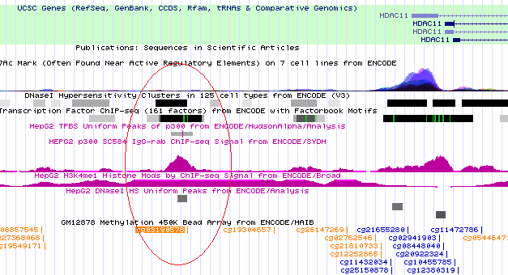
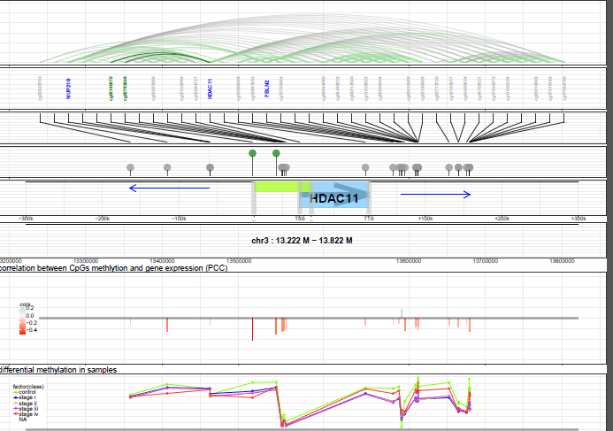
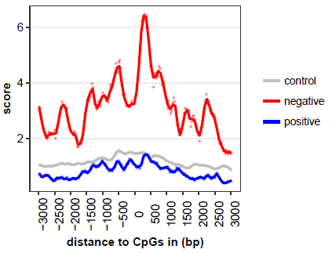
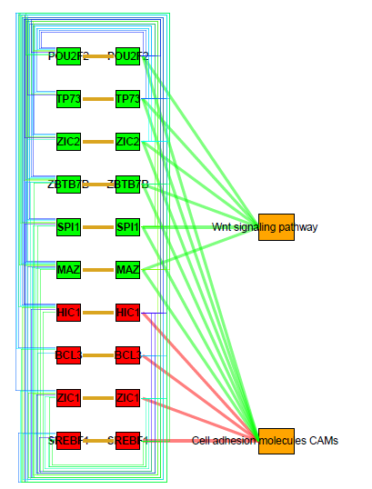

## Summary

Cancer, a complex and fatal disease, is the result of combined genetic and epigenetic alteration. It is widely accepted that hypermethylation on gene promoters would lead to down-regulation of tumor suppressors, but the regulation network between epigenome and transcriptome involved with distal methylation variations is still unknown. Here we present a method named "MICMIC" : "Methylation Regulation Network Inference by Conditional Mutual Information based PC-algorithm". Using this method, we can construct the cis-acting regulation network in a given range on the genome, and narrow down the number of potential regulatory sites by distinguishing direct correlation and indirect(conditional) correlation. These regulatory sites may act as functional genomic elements such as promoters and enhancers, which are responsible for regulation of gene expression. In the MICMIC package, we provide several functions based on information theory to implement the identification of regulators:

- Learning Mutual information (MI) and conditional mutual information (CMI)
- Inferring direct network of variables based on PC-Algorithm
- Inferring the cis-acting methylation regulatory network for genes
- Visualization of the results


---
---
## Installation of the package

MICMIC now can be installed by the downloaded source file. 

```{r, fig.show='hold', eval = FALSE}
install.packages("MICMIC_0.99.6.tar.gz",repos=NULL)
```

---
---
## Mutual information, conditional mutual information and exact test

MICMIC provide basic functions to learn mutual information and conditional mutual information for any variables (discrete variables and continuous variables). In information theory, the mutual information (MI) of two random variables is a measure of the mutual dependence between the two variables. It quantifies the "amount of information" (in units such as bits) obtained about one event, through the other event. 

Two random variables will show no dependence between each other, and their MI value will be close to 0.

```{r, fig.show='hold'}
library(MICMIC)
x<-rnorm(1000)
y<-rnorm(1000)
MI_result<-MI(x,y)
MI_result
```

If y is depending on of x, then the MI between x and y will be larger.

```{r, fig.show='hold'}
y<-x*x+x+rnorm(1000)
MI(x,y)
```

We can set `pvalue = TRUE` to do the exact test. MI will be transformed to normalized MI (between 0 and 1), and p value of the MI result will be tested by permutation.

```{r, fig.show='hold'}
MI(x,y,pvalue=TRUE)
```

The default unit of MI is "bits", and users can select "nats", "hartley" and "normalized" model.

```{r, fig.show='hold'}
MI(x,y,unit="nats")
```


The conditional mutual information is the expected value of the mutual information of two variables given the value of a third. Using the conditional mutual information, we can distinguish the direct dependency with the indirect dependency, and identify the direct connection between variables. We also implemented the exact test to reject the hypothesis of the direct dependency and calculate the P-value.

```{r, fig.show='hold'}
x<-rnorm(1000)
y<-0.5*x+rnorm(1000,sd=0.1)
z<-0.8*y+rnorm(1000,sd=0.1)
MI(x,y)
MI(y,z)
MI(x,z)
CMIxy<-CMI(x,y,z,pvalue=TRUE)
CMIxy$CMI
CMIxy$adj.pvalue
CMIxz<-CMI(x,z,y,pvalue=TRUE)
####the lower value of CMI between x and z on the
####condition of y, indicates that a indirect 
####connection between x and z which is depending on y 
CMIxz$CMI                    
CMIxz$adj.pvalue
```


---
---
## Using MICMIC to infer the network within variables

The PC algorithm uses conditional independence tests for model selection in graphical modeling with acyclic directed graphs. The example is build by an underline network with 8 edges: "x-y", "y-w", "y-v", "w-z", "v-z", "a-b" and "b-c". At first case we test the MI network construction. The first network will be inferred from edges confirmed by mutual information testing. 

example:
```{r, fig.show='hold'}
x=rnorm(100,mean=20,sd=6)
y=x+rnorm(100,mean=0,sd=3)
w=y*0.1+rnorm(100,mean=18,sd=1)
v=y*0.15+rnorm(100,mean=17,sd=1)
z=2*w+v+rnorm(100,mean=0,sd=0.1)
a=rnorm(100,mean=20,sd=5)
b=0.9*a+rnorm(100,mean=2,sd=1)
c=b-rnorm(100,mean=0,sd=3)
mydata<-rbind(x,y,w,v,z,a,b,c)
MI_PC_net<-PC_para(mydata,max_L=0,pre_adj=NULL,log_file_dir=tempdir(),
                   edgemode="pvalue",pvalue_cut=0.001,core_num=1)
```

There are several false positive edges in the network inference result. In order to improve the specificity of network inference, we can set the parameter "max_L" (the order of PC algorithm) to 1 to run the PC network construction by MI and CMI testing. The parameter `pre_adj` supports the user to input the pre-defined edges in the network with an adjacent matrix.

```{r, fig.show='hold'}
CMI_PC_net<-PC_para(mydata,max_L=1,method="CMII",pre_adj=NULL,
                    log_file_dir=tempdir(),
                    edgemode="pvalue",pvalue_cut=0.001,core_num=1)
```


---
---
## Using MICMIC to learn the direct regulation between CpGs methylation and gene expression

The major feature of MICMIC is to infer the methylation involved regulation network for target genes, and discover the direct regulators influencing target genes expression. This work can be done by four functions: `CMI_met_cis_network` for network inference, `generate_regulator_info` for generating result tables, `merge_regulator_info` to summarize the results of multiple genes and `MICMIC_plotting` to visualize the result. 


---
---
#### Data preparation

The `CMI_met_cis_network` function requires user to provide 1. A SummarizedExperiment object or a numeric matrix containing the methylation data with sample names in columns and probes (CpGs/CGIs) names in rows; 2. A SummarizedExperiment object or a numeric matrix containing the expression data with sample names in columns and probe(genes) names in rows; 3. The target gene names (one gene name or list of genes); 4. The range of upstream and downstream genome to be analyzed; 5. Reference coordinates data of genes in five columns named "name", "chr", "start", "end", "strand", in a GRanges object or a data.frame; 6. Reference coordinates data of methylation sites(CpGs/CGIs) in four columns names "name", "chr", "start", "end", in a GRanges object or a data.frame; 7. A directory to save the intermediate files and outputs.

We have already prepare two example datasets from TCGA. People can load the example data by `data(LIHC)` and `data("TCGA_STAD_data")`. In examples, we include expression data matrix and methylation data matrix for a limited number of genes and CpGs. Also, the bed format coordinates information are saved in the data.frame `ref_gene_bed` and `ref_CpGs_bed`.

```{r, fig.show='hold', eval = FALSE}
library(MICMIC)
data("LIHC")
head(sample_data)
head(exp_data_matrix)
head(met_data_matrix)
```

---
---
#### Infer the methylation regulation network 

In this example, we use the data matrix from TCGA-LIHC dataset to infer the methylation regulation. We designate the directory for result files and specify the gene list to be analyzed. Then we run the program:
```{r, fig.show='hold', eval = FALSE}

library(MICMIC)

data(LIHC)
head(gene_list)

outfiledir<-paste0(example_dir,"/result")    ######output directory for each gene
summarydir<-paste0(example_dir,"/result/summary")##output directory for summary result
dir.create(outfiledir)
dir.create(summarydir)

setwd(outfiledir)

####infer the cis-acting methylation regulatory network
mynet<-CMI_met_cis_network(met_data_matrix,exp_data_matrix,gene_list,
                           distance=300000,ref_gene_bed,ref_CpGs_bed,
                           outfiledir=outfiledir,pvalue_cut=0.01,core_num=1) ###
#core num can be set above 1 when using linux system

```

The CMI_met_cis_network function will return the adjacent matrix of the inferred network, and generate result files in the output directory. The result files contain the information of correlations, direct and indirect regulations, MI and CMI network matrix. All of these files are prefixed with target gene names. 

The associate regulation file give a list of all the associated genes and CpGs within the given range on genome. The MI and CMI network files contain the adjacent matrix after mutual information testing and conditional mutual information testing.

Finally we can use the `generate_regulator_info` function to integrate all vital information in the result table: 
```{r, fig.show='hold', eval = FALSE}
####generate result table####
generate_regulator_info(met_data_matrix,exp_data_matrix,
                        gene_list,outfiledir,ref_gene_bed,ref_CpGs_bed)
```

This function will also generate a `gene_regulator_info` file in the output directory. In the result file, we can find the information of target gene of CpGs(name, chr, coordinate), the regulation distance, the region where the CpGs located, and the Pearson correlations and p values. 

Finally results for all genes can be merged in the summary directory by `merge_regulator_info`. User can find the integrated result table in the directory, as well as read it into R console

```{r, fig.show='hold', eval = FALSE}
####merge result tables for genes####
merge_regulator_info(gene_list,outfiledir,statisticfiledir=summarydir,
                     ref_gene_bed)

####read the direct regulation information####
direct_info<-read.table(paste0(summarydir,"/direct_information.txt"),
                        sep="\t",as.is=TRUE)

####identify the direct regulation sites of HDAC11
direct_info[which(direct_info[,"target_name"]=="HDAC11"),]
```



---
---
#### Visualize the regulatory network

MICMIC has already provided a plotting function, MICMIC_plotting, to visualize the regulation network and other results. This function requires user to provide the output directory which contains the result tables from CMI_met_cis_network function. And all the figures will be put into a pdf file named "gene_met_regulation.pdf". 

For example, we can use the following code to generate the methylation regulation results of HDAC11 and to plot the figure by MICMIC_plotting.

```{r, fig.show=FALSE, eval = FALSE, results = "hide"}
####plot the cis-acting regulatory network####
control_id=sample_data[which(sample_data[,"stage"]=="control"),"sample_id"]
MICMIC_plotting(gene_name="HDAC11",met_data_matrix,exp_data_matrix,
                control_id=control_id,distance=300000,ref_gene_bed,
                ref_CpGs_bed,sample_data[,c("sample_id","stage")],
                outfiledir=outfiledir)
```



In the top panel of the result figure, there are correlation lines between genes and CpGs. The gray line represent the indirect correlation and the green line represent the direct correlation. And the dark green lines are always connected with target gene in center, which indicate the direct regulators correlated with target gene expression. The correlation panel is under the chromosome number, and it used the blue and red bars to represent the Pearson correlation coefficient and p-value between regulators and target gene expression. In the panel, blue bar means the correlation is positive, and the red bar means the correlation is negative. The bottom panel presents the methylation level on each site of different sample classes.


---
---
#### Annotate the genomic features of identified regulator sites
Histone mark score can be used to evaluate the genomic function of the identified direct regulatory elements (DREs). The `plot_histone_mark_score` can plot the average value of histone mark score around the detected DREs.

```{r, fig.show=FALSE, eval = FALSE}
################Plot the histone mark signal around DREs
data(histone_mark)      ##load the histone mark score surrounding the CpGs used in this example
head(CpGs_score_H3K4me1)
head(CpGs_score_p300)

direct_info<-read.table(paste0(summarydir,"/direct_information.txt"),
                        sep="\t",as.is=TRUE)
direct_info$type<-"positive"
direct_info$type[which(direct_info[,"pearson_cor"]<0)]<-"negative"

mycolors<-c("control"="grey","positive"="blue","negative"="red")
name="H3K4me1"
CpGs_score<-CpGs_score_H3K4me1
plot_histone_mark_score(direct_info,name,CpGs_score,
                        colors=mycolors,
                        range=3000,figure_dir=summarydir,CpGs_annotation)
    
mycolors<-c("control"="grey","positive"="blue","negative"="red")
name="p300"
CpGs_score<-CpGs_score_p300
range<-3000
plot_histone_mark_score(direct_info,name,CpGs_score,
                        colors=mycolors,
                        range=3000,figure_dir=summarydir,CpGs_annotation)

```




---
---
## Study the transcription factors binding on direct regulatory sites

---
---
#### Calculate the odds ratio of each transcription factor binding on the identified CpGs
To identify the core transcription factors that bind on the identified regulatory sites, MICMIC calculates the odds ratio and confidence interval of each TF for a given CpGs list. The following example illustrates the computation of TF enrichment on an example list of 10,000 CpG-target regulation pairs. A two-column data.frame containing the mapping information of CpGs on the transcription factor binding sites need to be provided.
```{r, fig.show=FALSE, eval = FALSE}

data(TF_data)
motif_data[1,]

CpGs_list=unique(CpG_target[,1])

##########Calculate the TF enrichment on the regulatory sites
TF_binding<-TF_binding_enrichment(motif_data=motif_data,CpGs_list=CpGs_list,control_list=control_list)

head(TF_binding[,1:6])

##########Generate TF-target regulation network
TF_network<-TF_target_network(TF_binding,CpG_target)

head(TF_network)
```

#### Identification of the core regulatory circuit
Super-enhancers associated oncogenic TFs have been studied to play an important role in cancer gene regulation. The set of key TFs can by connected by the super-enhancers and to make up a core regulatory circuitry (CRC). In each core regulatory circuit, TFs are self-connected and auto-regulated through binding sites on its corresponding SE, as well as cross-regulated by each other through an interconnected loop with binding sites on other TF related SEs. MICMIC used the TF-CpGs-target information to discover the core regulatory circuit. The following example illustrates the identification of CRC on an example list of 10,000 CpG-target regulation pairs.

```{r, fig.show=FALSE, eval = FALSE}
TF_circuit<-selfconnected_TF_circuit(TF_binding,CpG_target,CpGs_in_SE)
TF_circuit_core<-select_TF_circuit(TF_circuit,OR=1.05,super_enhancer=TRUE)
head(TF_circuit_core)
```


#### Functional analysis of CRC TF targets and plotting the interconnected CRC network
The following example shows the functional analysis of the core regulatory circuits by providing a gene set data of kegg pathway.
```{r, fig.show=FALSE, eval = FALSE}
data(TF_data)
head(function_gmt)

core_TFs<-unique(TF_circuit_core[,"motif_TF"])
######User can assign cluster number to the CRC TFs by any clustering method
cluster<-sample(c(1,2),length(core_TFs),replace=TRUE)  
core_TF_clusters<-data.frame(core_TFs,cluster)   

######Study the function of targets of the CRC TF in each cluster
circuit_function<-functional_enrichment_of_core_circuit(TF_network,
                                                        core_TF_clusters,
                                                        function_gmt)
head(circuit_function)
```


Finally the interconnected core regulatory circuit network can be visualized by `plot_core_circuit`.
```{r, fig.show=FALSE, eval = FALSE}
######Visualization of the interconnected CRC network
outpath=paste0(example_dir,"/result/summary")
plot_core_circuit(TF_circuit_core,TF_class_data=core_TF_clusters,
                  TF_pathway_data=circuit_function,outpath=outpath)
```




