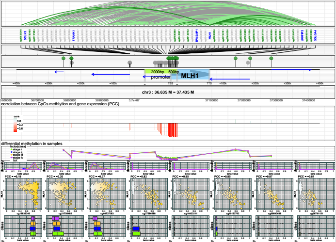

## Summary

Cancer, a complex and fatal disease, is the result of combined genetic and epigenetic alteration. It is widely accepted that hypermethylation on gene promoters would lead to down-regulation of tumor suppessors, but the regulation network between epigenome and transcriptom involved with distal methylation variations is still unknown. Here we present a new method named `MICMIC` : `Methylation Regulation Network Inference by Conditional Mutual Information based PC-algorithem`. Using this method, we can construct the cis-acting regulation network in a given range on the genome, and narrow down the number of potential regulatory sites by distinguishing direct correlation and indirect(conditional) correlation. These regulatory sites may act as functional genomic elements such as promoters and enhancers, which are responsible for regulation of gene expression. In the MICMIC package, we provide several functions based on information theory to implement the identification of regulators:

- Learning Mutual information (MI) and conditional mutual information (CMI)
- Infering direct network of variables based on PC-Algorithm
- Infering the cis-acting methylation regulatory network for genes
- Visualization of the direct regulations


## Using MICMIC to learn the direct regulation between CpGs methylation and gene expression

The major feature of MICMIC is to infer the methylation involved regulation network for target genes, and discover the direct regulators influencing target genes expression. This work can be done by four functions: `CMI_met_cis_network` for network inference, `generate_regulator_info` for generating result tables, `merge_regulator_info` to summarize the results of multiple genes and `MICMIC_plotting` to visualize the result. 

### Data preparation

The `CMI_met_cis_network` function requires user to provide 1. A SummarizedExperiment object or a numeric matrix containing the methylation data with sample names in columns and probes (CpGs/CGIs) names in rows; 2. A SummarizedExperiment object or a numeric matrix containing the expression data with sample names in columns and probe(genes) names in rows; 3. The target gene names (one gene name or list of genes); 4. The range of upstream and downstream genome to be analyzed; 5. Reference coordinates data of genes in five columns named "name", "chr", "start", "end", "strand", in a GRanges object or a data.frame; 6. Reference coordinates data of methylation sites(CpGs/CGIs) in four columns names "name", "chr", "start", "end", in a GRanges object or a data.frame; 7. A directory to save the intermediate files and outputs.

We have already prepare two example datasets from TCGA. People can load the example data by `data("TCGA_HNSC_data")` and `data("TCGA_STAD_data")`. In this two datasets, we include expression data matrix and methylation data matrix for a limited number of genes and CpGs. Also, the bed format coordinates information are saved in the data.frame `ref_gene_bed` and `ref_CpGs_bed`.

```{r, fig.show='hold'}
library(MICMIC)
data("TCGA_HNSC_data")
data("TCGA_STAD_data")
```

### Infer the methylation regulation network for one gene

In the beginning, we can try to analyze the methylation regulation network for MLH1 in gastric cancer, using the CMI_met_cis_network function. 

In this example, we use the data matrix from TCGA-STAD dataset to analyze the methylation regulation of MLH1, a well known tumor suppressor of gastric cancer. We designate the directory for result files and specify the "MLH1" as the target gene name. Then we run the program:

```{r, fig.show='hold', eval = TRUE}

library(MICMIC)
library(SummarizedExperiment)
library(GenomicRanges)

data("TCGA_STAD_data")
gene_name<-"MLH1"

######prepare the data################
colData<-DataFrame(sample_stages=STAD_sample_class[colnames(STAD_met_data_matrix),"stage"],row.names=colnames(STAD_met_data_matrix))
STAD_met_data_SE <- SummarizedExperiment(assays=SimpleList(counts=STAD_met_data_matrix),
                                       colData=colData)
STAD_exp_data_SE <- SummarizedExperiment(assays=SimpleList(counts=STAD_exp_data_matrix),
                                         colData=colData)


STAD_ref_gene_bed_GR <-  GRanges(seqnames = Rle(STAD_ref_gene_bed[,"chr"]),
                       ranges = IRanges(STAD_ref_gene_bed[,"start"], end=STAD_ref_gene_bed[,"end"], 
                                        names = STAD_ref_gene_bed[,"name"]),
                       strand = Rle(STAD_ref_gene_bed[,"strand"])
)

STAD_ref_CpGs_bed_GR <-  GRanges(seqnames = Rle(STAD_ref_CpGs_bed[,"chr"]),
                                 ranges = IRanges(STAD_ref_CpGs_bed[,"start"], end=STAD_ref_CpGs_bed[,"end"], 
                                                  names = STAD_ref_CpGs_bed[,"name"])
)

####infer the cis-acting methylation regulatory network
CMI_met_cis_network(met_data_matrix=STAD_met_data_matrix,exp_data_matrix=STAD_exp_data_matrix,
                             gene_list=gene_name,distance=300000,ref_gene_bed=STAD_ref_gene_bed,
                             ref_CpGs_bed=STAD_ref_CpGs_bed,outfiledir=tempdir(),
                             pvalue_cut=0.0001,core_num=1)

```

When the function is running, the MICMIC will show many information on the terminal to report the progress. It will tell users how many CpGs and genes are correlated with the target gene expression (p value from cor.test(Pearson) < 0.01), and then these correlation relationship will be tested in the CMI network construction progress.In the result it will report the number of direct correlation and indirect correlation in the network.

The CMI_met_cis_network function will return the final adjacent matrix, and generate 6 result files in the output directory. The result files contain the information of correaltions, direct and indirect regulations, MI and CMI network matrix. All of these files are prefixed with target gene names. 

The associate regulation file give a list of all the associated genes and CpGs within the given range on genome. And the direct and indirect regulation file give the lists of direct and indirect regulators identified by MICMIC. The indirect regulation file will show the passenger mediating the indirect connection, which can be found in the third column. The MI and CMI network files contain the adjacent matrix after mutual information testing and conditional mutual information testing.

Finally we can use the `generate_regulator_info` function to integrate all vital information in the result table: 
```{r, fig.show='hold', eval = TRUE}
####plotting the cis-acting regulatory network####
gene_name="MLH1"
result<-generate_regulator_info(met_data_matrix=STAD_met_data_SE,exp_data_matrix=STAD_exp_data_SE,
                                gene_list=gene_name,ref_gene_bed=STAD_ref_gene_bed_GR,
                                ref_CpGs_bed=STAD_ref_CpGs_bed_GR,outfiledir=tempdir())
head(result)
```

This function will also generate a `gene_regulator_info` file in the output directory. In the result file, we can find the information of target gene of CpGs(name, chr, coordinate), the regulation distance, the region where the CpGs located, and the Pearson correlations and p values. 

### Visualize the regulatory network

MICMIC has already provided a plotting function, MICMIC_plotting , to visualize the regulation network and other results. This function requires user to provide the output directory which contains the result tables from CMI_met_cis_network function. And all the figures will be put into a pdf file named "gene_met_regulation.pdf". 

For example, we can use the following code to generate the methylation regulation results of MLH1 and to plot the figure by MICMIC_plotting.

```{r, fig.show=FALSE, eval = FALSE, results = "hide"}
####plot the cis-acting regulatory network####
MICMIC_plotting(gene_name=gene_name,met_data_matrix=STAD_met_data_SE,exp_data_matrix=STAD_exp_data_SE,
                distance=300000,
                ref_gene_bed=STAD_ref_gene_bed_GR,ref_CpGs_bed=STAD_ref_CpGs_bed_GR,
                sample_class=STAD_sample_class,outfiledir=tempdir())


```



In the top panel of the result figure, there are correlation lines between genes and CpGs. The gray line represent the indirect correlation and the green line represent the direct correlation. And the dark green lines are always connected with target gene in center, which indicate the direct regulators correlated with target gene expression. The correlation panel is under the chromosome number, and it use the blue and red points to represent the Pearson correlation coefficient and p-value between regulators and target gene expression. In the panel, blue point means the correlation is positive, and the red point means the correlation is negative. For MLH1, the hypermethylation on promoter CpGs inhibits gene expression, and methylation on several distal CpGs are directly correlated with PLK1 expression. In the bottom panel, the scatter plots show the methylation alteration for each CpG site, and direct and indirect CpGs are distinguished by background colors green and gray.

In this result, MICMIC identifies the direct regulators located in the promoter region of MLH1. MICMIC narrows candidate CpGs, on which  hypermethylation induce the silencing of the gene expression.


## Mutual information, conditional mutual information and exact test

Besides the methylation regulatory network inference, We additionally provide basic functions to learn mutual information and conditional mutual information for any variables (discrete variables and continuous variables). In probability theory and information theory, the mutual information (MI) of two random variables is a measure of the mutual dependence between the two variables. More specifically, it quantifies the "amount of information" (in units such as bits) obtained about one random variable, through the other random variable. The concept of mutual information is intricately linked to that of entropy of a random variable, a fundamental notion in information theory, that defines the "amount of information" held in a random variable.

Two random variables will show no dependence between each other, and their MI value will be close to 0.

```{r, fig.show='hold'}
library(MICMIC)
x<-rnorm(1000)
y<-rnorm(1000)
MI_result<-MI(x,y)
MI_result
```

If y is depending on of x, then the MI between x and y will be higher.

```{r, fig.show='hold'}
y<-x*x+0.5*x+rnorm(1000,sd=0.1)
MI(x,y)
```

We can set `pvalue = TRUE` to do the exact test. MI will be transformed to normalized MI (between 0 and 1), and p value of the MI result will be tested by permutation.

```{r, fig.show='hold'}
MI(x,y,pvalue=TRUE)
```

The default unit of MI is ???bits???, and users can select "nats", "hartley" and "normarlized" model.

```{r, fig.show='hold'}
MI(x,y,unit="nats")
```

For discrete variables, the probabilities `fa` in entropy calculation  can be simply approached by the counts of events. However, for continuous variables (like gene expression) we need to estimate the probability distribution from measurements. Some estimators some estimators have focused on a histogram-based approach, dividing each axis into M discrete non-overlapping intervals (bins), and that???s called discretizing (Meyer, et al., 2008). An alternative to this method, based on kernel density estimation (KDE), was suggested by (Moon, et al., 1995) and was found to be superior to the histograms in terms of (i) a better mean square error rate of convergence of the estimate to the underlying density, (ii) an insensitivity to the choice of origin, and (iii) the ability to specify more sophisticated window shapes than the rectangular window for frequency counting. Based on KDE, the estimation of probability distribution have been used in our mutual information calculation:

```{r, fig.show='hold', eval = FALSE}
entropy(x,method="density")
MI(x,y,method="KDE")

```

In probability theory, and in particular, information theory, the conditional mutual information is, in its most basic form, the expected value of the mutual information of two random variables given the value of a third. Using the conditional mutual information, we can distinguish the the direct dependency with the indirect dependency, and identify the direct connection between variables. We also implemented the exact test to reject the hypothesis of the direct dependency and calculate the P-value.

```{r, fig.show='hold'}
x<-rnorm(1000)
y<-0.5*x+rnorm(1000,sd=0.1)
z<-0.8*y+rnorm(1000,sd=0.1)
MI(x,y)
MI(y,z)
MI(x,z)

CMIxy<-CMI(x,y,z,pvalue=TRUE)
CMIxy$CMI
CMIxy$adj.pvalue
CMIxz<-CMI(x,z,y,pvalue=TRUE)
CMIxz$CMI
CMIxz$adj.pvalue
```


## Using MICMIC to infer the network within variables

The PC algorithm uses conditional independence tests for model selection in graphical modeling with acyclic directed graphs. The example is build by an underline network with 8 edges: "x-y", "y-w", "y-v", "w-z", "v-z", "a-b" and "b-c". At first case we test the MI network construction. The first network will be infered from edges confirmed by mutual information testing. 

example:
```{r, fig.show='hold'}
x=rnorm(100,mean=20,sd=6)
y=x+rnorm(100,mean=0,sd=3)
w=y*0.1+rnorm(100,mean=18,sd=1)
v=y*0.15+rnorm(100,mean=17,sd=1)
z=2*w+v+rnorm(100,mean=0,sd=0.1)
a=rnorm(100,mean=20,sd=5)
b=0.9*a+rnorm(100,mean=2,sd=1)
c=b-rnorm(100,mean=0,sd=3)
mydata<-rbind(x,y,w,v,z,a,b,c)
MI_PC_net<-PC_para(mydata,max_L=0,pre_adj=NULL,log_file_dir=tempdir(),
                   edgemode="pvalue",pvalue_cut=0.001,core_num=1)
MI_PC_net
```

There are several false positve edges in the network inference result. In order to improve the specificity of network inference, we can set the parameter "max_L" (the order of PC algorithm) to 1 to run the PC network construction by MI and CMI testing. The parameter `pre_adj` supports the user to input the pre-defined edges in the network with an adjacent matrix.

```{r, fig.show='hold'}
CMI_PC_net<-PC_para(mydata,max_L=1,method="CMII",pre_adj=NULL,log_file_dir=tempdir(),
                    edgemode="pvalue",pvalue_cut=0.001,core_num=1)
CMI_PC_net
```

In the result, we have successfully deleted the false positive edges and reserve the true positive edges.


